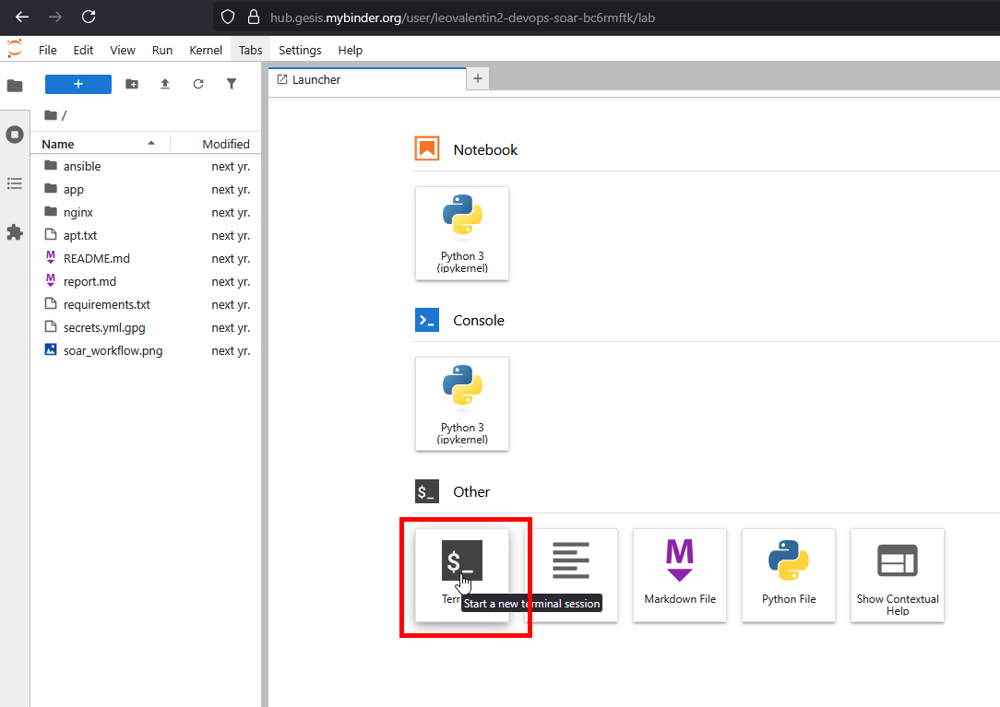

# Building a Mini-SOAR with Ansible, Python, Flask and Nginx to triage suspicious IP addresses

- **Names and KTH ID:** Leo Hansson Åkerberg (leo3@kth.se)
- **Deadline:** Task 3
- **Category:** Executable tutorial

---

Welcome to this hands-on tutorial where you will build and interact with an event-driven SOAR (Security Orchestration, Automation, and Response) pipeline. You will learn how to automate security workflows by integrating tools like Ansible and Flask to triage and respond to threats in real time.

### Intended Learning Outcomes
By completing this tutorial, you will:
- Understand the core principles of a SOAR workflow (Trigger, Enrich, Respond).
- Get a grasp of Ansible, orchestrating a security process that calls external scripts and APIs.
- Manage a system service (Nginx) with Ansible to enforce a security policy.
- Utilize a simple Flask API endpoint acting as a webhook, making your automation triggerable by other services.
- Gain practical experience in working with an automated DevSecOps toolchain.

### Why This Matters for DevSecOps
Traditional security models, where testing happens at the end of the development cycle, are too slow for modern CI/CD. DevSecOps is about integrating automated security practices directly into the development and operations pipeline. This project is a practical example of this philosophy. By automating security responses, we can:
- **Detect and Respond Faster:** Reduce time to action after an alert has been triggered.
- **Reduce manual labor:** Free up security analysts from repetitive, manual tasks like IP lookups.
- **Enforce Consistent Security:** Ensure that every alert is handled using a standardized, predefined process (like an Ansible playbook).
- **Enable "Security as Code":** Treat your security workflows as code. This allows for versioning, peer review, and continuous improvement.

### Tutorial Architecture
This tutorial implements an event-driven SOAR workflow. The process is initiated by a simulated alert, which triggers a series of automated enrichment and response actions on a live Nginx web server.


### Understanding the Core Technologies

Before we begin with the tutorial, let us explore some key concepts.

#### **What is SOAR?**
SOAR stands for **Security Orchestration, Automation, and Response**. It is not a single tool, but more like a philosophy for connecting security tools to automate workflows.
* **Orchestration:** The Ansible playbook acts as the orchestrator, connecting our Flask API, Python scripts, and the system Nginx service into a single process.
* **Automation:** Once triggered, the workflow runs from start to finish without human intervention.
* **Response:** The final action is to add a malicious IP to a blocklist and reload our web server.

#### **What is Ansible and why do we use it?**
Ansible is a DevOps tool that typically is used for configuration management and application deployment, but its design makes it a good choice for SOAR orchestration.
* **Human-Readable Playbooks:** Workflows are defined in simple, task-based YAML files.
* **Powerful Modules:** We use the `command` module to run scripts and the `ansible.builtin.service` module to manage the Nginx service.
* **State Management:** Ansible makes sure that the system matches a desired state. If Nginx is already configured correctly, Ansible makes no changes. This makes automation safe and predictable.

---

### **The Interactive Walkthrough**

#### **A Note on Secrets**
This project requires API keys to function. These keys should be kept secret and are not committed to the repository. For this reason, a `secrets.yml.gpg` is included, which can be decrypted by using the corresponding private GPG key. For this interactive tutorial, you will be pasting these API keys into a yml-file in Step 4.

#### **Step 1: Launch the Environment**
Click the "launch binder" badge below. This will take a few minutes to build the environment and will open in a new tab.

[](https://mybinder.org/v2/gh/leovalentin2/devops-soar/main)

#### **Step 2: Open a Terminal**
When the environment loads, you will see the JupyterLab interface shown below. In the main "Launcher" tab, find the "Other" section and click the **Terminal** icon. This will open a new tab with a command-line interface. All subsequent `bash` commands will be run here.

 

#### **Step 3: Start the Background Services**
This tutorial requires a flask endpoint to be running in the background: this is how we simulate alarms in this tutorial. In a real-world setting, the alarm would probably originate from an IDS or SIEM-tool.

**Starting the Flask API Server:** Start our Flask application in the background. This will listen for our `curl` commands.
    ```bash
    python3 app/app.py > flask.log 2>&1 &
    ```

After running these commands, please wait a few seconds for the service to initialize properly before proceeding to the next step.

#### **Step 4: Create and Populate the Secrets File**
Now the background services are running, but they need API keys to function. We will now create the `secrets.yml` file.

1.  In the file browser on the left-hand side of the JupyterLab interface, right-click on the empty space in the file list and select **New File**.
2.  An untitled file will be created. Rename it to exactly `secrets.yml` and press `Enter`.
3.  Double-click your new `secrets.yml` file. It will open in the editor pane.
4.  Paste the following content into the file, replacing the placeholders with your actual keys obtained from the encrypted `secrets.yml.gpg`.
    ```yaml
    abuseipdb_key: YOUR_ABUSEIPDB_KEY_HERE
    virustotal_key: YOUR_VIRUSTOTAL_KEY_HERE
    ```
5.  Save the file by pressing `Ctrl+S`.

#### **Step 5: Take a Look Around**
Since your environment is now fully set up and ready, let's verify the tools we have at our disposal. Run the following commands:

```bash
python3 --version
ansible --version
nginx -v
```

You can see all our core technologies are installed, including the Nginx web server. Our orchestrator is **Ansible**. But what is it actually doing? Let us dive a bit deeper into the playbook.

In the file browser on the left, open `ansible/playbook.yml` and carefully study its contents. In the first part, we setup and configure the Nginx service. The first time the playbook runs, it will install, configure, and start Nginx for us. It uses `become: yes`, which tells Ansible to run these tasks with sudo privileges. The second part, "Threat Intelligence Gathering and Response," contains our core SOAR logic:

```yaml
- name: Threat Intelligence Gathering and Response
  hosts: localhost
  connection: local
  become: yes
  vars:
    ip_to_check: "8.8.8.8"

  tasks:
    - name: Ensure blocklist is clean before run
      ansible.builtin.copy:
        content: ""
        dest: /etc/nginx/blocklist.conf
        mode: '0644'

    - name: Run AbuseIPDB enrichment script
      command: "python3 ../app/scripts/check_abuseipdb.py {{ ip_to_check }}"
      register: abuse_raw_result
      changed_when: false
      become: no

    - name: Parse AbuseIPDB JSON output
      set_fact:
        abuse_result: "{{ abuse_raw_result.stdout | from_json }}"
    
    # ... (VirusTotal tasks are similar) ...

    - name: Block malicious IP if abuse score is high
      ansible.builtin.lineinfile:
        path: /etc/nginx/blocklist.conf
        line: "deny {{ ip_to_check }};"
      when: abuse_result.abuseConfidenceScore | int > 90
      notify: Reload Nginx
```

Here, we can see how Ansible runs our Python script through the `command` module and captures the script's output with `register`. It then uses `set_fact` to parse that output into a structured variable (`abuse_result`). A critical piece is the `when:` clause, which makes our automation "intelligent" by only running the blocking task if the abuse score is greater than 90.

#### **Step 6: Triage a Malicious IP**
Now, let's trigger the workflow. We will act as an IDS and send an alert about a known malicious IP to our Flask API.

```bash
curl -X POST -H "Content-Type: application/json" -d '{"ip": "185.191.171.12"}' http://127.0.0.1:5000/triage
```

The terminal will return a JSON object containing the threat intelligence report for this IP.

#### **Step 7: Verify the Block & Understand the Workflow**
So, what just happened? The playbook executed the "Response" part of our SOAR workflow. Let us verify it.

```bash
sudo cat /etc/nginx/blocklist.conf
```

You will see the line `deny 185.191.171.12;`. The IP has been blocked.

**Under the hood - what happened with the request?**
1.  Your `curl` command sent the IP to the **Flask API**.
2.  The Flask app triggered the **Ansible Playbook**.
3.  The playbook queried **AbuseIPDB** and found an `abuseConfidenceScore` of 100.
4.  The `when: abuse_result.abuseConfidenceScore | int > 90` condition evaluated to **TRUE**.
5.  Ansible executed the `lineinfile` task, updating `/etc/nginx/blocklist.conf` and notifying the "Reload Nginx" handler.
6.  At the end of the playbook run, the notified handler was executed, which ran `service nginx reloaded` to apply the block.

#### **Step 8: Triage a Good IP**
Now, let us see how our system handles a non-threatening IP. This will test the playbook's conditional logic.

```bash
curl -X POST -H "Content-Type: application/json" -d '{"ip": "8.8.8.8"}' http://127.0.0.1:5000/triage
```

You will receive a clean report and the `abuseConfidenceScore` will be 0. Since 0 is not greater than 90, the `when:` condition in the playbook will evaluate to ``false``. Therefore, the update of the blocklist should be skipped.

#### **Step 9: Verify No Action Was Taken**
Let us check the blocklist again.

```bash
sudo cat /etc/nginx/blocklist.conf
```

As predicted, the file is now empty. The playbook ran the initial task but correctly skipped the tasks to add the IP and reload Nginx. This proves that our automation is working. Congratulations! You have now gained some practical experience related to SOAR workflows!

### **Easter Egg**
Home, sweet home. Try triaging your localhost IP address. What happens?

```bash
curl -X POST -H "Content-Type: application/json" -d '{"ip": "127.0.0.1"}' http://127.0.0.1:5000/triage
```