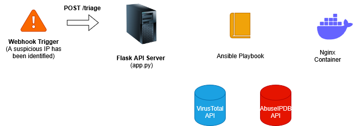

# Building a Mini-SOAR with Ansible, Docker, and Flask to triage suspicious IP addresses

- **Names and KTH ID:** Leo Hansson Åkerberg (leo3@kth.se)
- **Deadline:** Task 3
- **Category:** Executable tutorial

---

Welcome to this hands-on tutorial where you will build and interact with a miniature, event-driven SOAR (Security Orchestration, Automation, and Response) pipeline. You'll learn how to automate security workflows by integrating common DevOps tools like Ansible, Docker, and Flask to triage and respond to threats in real time.

### Learning Outcomes
By completing this tutorial, you will:
- Understand the core principles of a SOAR workflow (Trigger, Enrich, Respond).
- Get a grasp of Ansible, orchestrating a security process that calls external scripts and APIs.
- Manage the state of a running Docker container with Ansible to enforce a security policy.
- Build a simple Flask API endpoint to act as a webhook, making your automation triggerable by other services.
- Gain practical experience in building a complete, automated DevSecOps toolchain.

### Why This Matters for DevSecOps
Traditional security models, where testing happens at the end of the development cycle, are too slow for modern CI/CD. DevSecOps is about integrating automated security practices directly into the development and operations pipeline. This project is a practical example of this philosophy. By automating security responses, we can:
- **Detect and Respond Faster:** Reduce the time from alert to action from hours to seconds.
- **Reduce Human Toil:** Free up security analysts from repetitive, manual tasks like IP lookups.
- **Enforce Consistent Security:** Ensure that every alert is handled using a predefined, version-controlled process (an Ansible playbook).
- **Enable "Security as Code":** Treat your security workflows as code, allowing for versioning, peer review, and continuous improvement.

### Tutorial Architecture
This tutorial implements a complete, event-driven SOAR workflow. The process is initiated by a simulated alert, which triggers a series of automated enrichment and response actions.



### Understanding the Core Technologies

Before we execute the tutorial, let's explore the key concepts.

#### **What is SOAR?**
SOAR stands for **Security Orchestration, Automation, and Response**. It's not a single tool, but a philosophy for connecting security tools to automate workflows.
* **Orchestration:** This is the "connector" part. Our Ansible playbook acts as the orchestrator, connecting our custom Flask API, our Python scripts, the external APIs, and the Docker container into a single, cohesive process.
* **Automation:** This is the "engine" part. Once the workflow is triggered, it runs from start to finish without human intervention. This is what allows for near-instantaneous response times.
* **Response:** This is the final action taken by the system. In our case, the response is to add a malicious IP to a blocklist and reload our web server, but in a real-world scenario, it could also be to quarantine a machine, disable a user account, or create a ticket in a helpdesk system.

#### **Why Ansible for Orchestration?**
Ansible is a powerful DevOps tool typically used for configuration management and application deployment, but its design makes it perfect for SOAR orchestration.
* **Human-Readable Playbooks:** Ansible's workflows are defined in YAML files called "Playbooks." As you'll see in our code, they are structured like a simple list of tasks, making them easy to read and understand.
* **Powerful Modules:** The core of Ansible is its vast library of modules—pre-built pieces of code that perform specific actions. We use the `command` module to run our scripts, the `template` module to generate reports, and the `docker_container` module to manage our Nginx server.
* **Idempotency:** This is a key principle in DevOps. An operation is "idempotent" if running it multiple times has the same effect as running it once. Our "Ensure the Nginx container is running" task is a perfect example. If the container is already running, Ansible does nothing. If it's stopped, Ansible starts it. This ensures a consistent and predictable state.

---

### **The Interactive Walkthrough**

#### **A Note on Secrets**
This project requires API keys to function. These keys should be kept secret and are not committed to the repository. For this course, a `secrets.yml.gpg` file may be included, which can be decrypted by the course instructor using the provided private GPG key to retrieve the author's keys for evaluation. For this interactive tutorial, you will be providing your own keys in Step 2.

#### **Step 1: Launch the Environment**
Click the "launch binder" badge below. This will take a few minutes as it builds the complete, pre-configured environment. The `start` script will automatically run, preparing all the necessary services in the background.

[](https://mybinder.org/v2/gh/leovalentin2/devops-soar/tree/main/main)

#### **Step 2: Take a Look Around**
When the environment loads, you will be in a ready-to-use terminal. Let's verify the tools we have at our disposal. Run the following commands:

```bash
python3 --version
docker --version
ansible --version
```

You can see all our core technologies are installed. Our orchestrator is **Ansible**, a powerful tool for automation. But what is it actually doing? Let's look at its "brain"—the playbook.

In the file browser on the left, open `ansible/playbook.yml`. The most important part is the second "play," where the logic happens:

```yaml
- name: Threat Intelligence Gathering and Response Playbook
  hosts: localhost
  connection: local
  # ...
  tasks:
    - name: Ensure blocklist is clean before run
      ansible.builtin.copy:
        content: ""
        dest: ../nginx/blocklist.conf

    - name: Run AbuseIPDB enrichment script
      command: "python3 ../app/scripts/check_abuseipdb.py {{ ip_to_check }}"
      register: abuse_raw_result

    - name: Parse AbuseIPDB JSON output
      set_fact:
        abuse_result: "{{ abuse_raw_result.stdout | from_json }}"
    
    # ... (VirusTotal tasks are similar) ...

    - name: Block malicious IP if abuse score is high
      ansible.builtin.lineinfile:
        path: ../nginx/blocklist.conf
        line: "deny {{ ip_to_check }};"
      when: abuse_result.abuseConfidenceScore | int > 90 # Value can be changed, depending on risk tolerance
```

Here, Ansible defines a series of **tasks**. It runs our Python script using the `command` module, captures the script's output with `register`, and then uses `set_fact` to parse that output into a structured variable (`abuse_result`). The most critical piece is the `when:` clause, which makes our automation "intelligent"—it only runs the blocking task if the abuse score is greater than 90.

Now that you understand how the playbook works, let's provide the API keys it needs.
1.  Decrypt the `secrets.yml.gpg` file from the file browser on the left.
2.  Paste them into `secrets.yml`.
2.  Save the file (`Ctrl+S`).

```yaml
abuseipdb_key: YOUR_ABUSEIPDB_KEY_HERE
virustotal_key: YOUR_VIRUSTOTAL_KEY_HERE
```

#### **Step 3: Triage a Malicious IP**
Now, let's trigger the workflow. We will act as an IDS and send an alert about a known malicious IP to our Flask API.

```bash
curl -X POST -H "Content-Type: application/json" -d '{"ip": "185.191.171.12"}' http://127.0.0.1:5000/triage
```

The terminal will return a JSON object containing the full threat intelligence report for this IP.

#### **Step 4: Verify the Block & Understand the Workflow**
So, what just happened? The playbook executed the "Response" part of our SOAR workflow. Let's verify it.

```bash
cat nginx/blocklist.conf
```

You will see the line `deny 185.191.171.12;`. The IP has been blocked.

**Here's the journey your request took:**
1.  Your `curl` command sent the IP to the **Flask API**.
2.  The Flask app triggered the **Ansible Playbook**.
3.  The playbook queried **AbuseIPDB** and found an `abuseConfidenceScore` of 100.
4.  The `when: abuse_result.abuseConfidenceScore | int > 90` condition evaluated to **TRUE**.
5.  Ansible therefore executed the final tasks: it updated the `blocklist.conf` file and then ran `docker exec` to command the Nginx container to reload its configuration, making the block take effect instantly.

#### **Step 5: Triage a Good IP**
Now, let's see how our system handles a non-threatening IP. This will test the playbook's conditional logic.

```bash
curl -X POST -H "Content-Type: application/json" -d '{"ip": "8.8.8.8"}' http://127.0.0.1:5000/triage
```

You will receive a clean report. The `abuseConfidenceScore` will be 0. Since 0 is not greater than 90, the `when:` condition in the playbook will evaluate to **FALSE**. Therefore, the blocking tasks should be skipped.

#### **Step 6: Verify No Action Was Taken**
Let's check the blocklist again.

```bash
cat nginx/blocklist.conf
```

As predicted, the file is now empty. The playbook ran its initial "clean slate" task but correctly skipped the tasks to add the IP and reload Nginx. This proves our intelligent automation is working.

### **Easter Egg**
There's no place like home. Try triaging the localhost IP address.

```bash
curl -X POST -H "Content-Type: application/json" -d '{"ip": "127.0.0.1"}' http://127.0.0.1:5000/triage
```